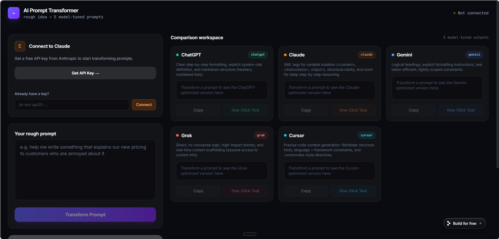

<div align="center">

<!-- Logo -->


<br/><br/>

<p>
  <strong>Turn one rough idea into 5 model-optimized prompts — instantly, side by side.</strong>
</p>

<p>
  <a href="https://github.com/KodeRaj3108/AI-PROMPT-TRANSFORMER"></a>
  
  
  
</p>

</div>

---

## What It Does

**AI Prompt Transformer** takes a single unpolished prompt and transforms it into five uniquely optimized versions, each designed for a specific AI model's reasoning style and formatting expectations:

| Model | Optimization Focus |
|---|---|
| **ChatGPT** | Step-by-step formatting, system-role definitions, markdown structure |
| **Claude** | XML variable isolation (`<context>`, `<instructions>`, `<input>`), deep reasoning |
| **Gemini** | Logical headings, explicit formatting instructions, token efficiency |
| **Grok** | Direct no-nonsense logic, high-impact brevity, real-time context scaffolding |
| **Cursor** | Code-context generation, file-structure hints, language-specific directives |

---

## Features

- **Side-by-side Comparison Workspace** — All 5 outputs visible at once, no tabs
- **One-Click Test** — Deep-links directly to ChatGPT, Claude, Gemini, and Grok; shows a paste guide for Cursor
- **History Log** — Every successful transformation is saved to `localStorage` and reloadable with a single click
- **Clear History** — Wipe the log whenever you want a clean slate
- **Animated Loading States** — Skeleton cards during API fetch
- **Error Handling** — Clean alerts for missing API keys or network issues
- **Dark-mode-first UI** — Glassmorphism cards, neon indigo/violet accents, smooth micro-interactions

---

## Screenshots

> *(Add a screenshot of your running app here — drag an image file into this section on GitHub)*



---

## Getting Started

### Prerequisites

- A modern browser (Chrome, Firefox, Edge, Safari)
- An [Anthropic API Key](https://console.anthropic.com/) — free tier is sufficient for testing

### Run Locally

```bash
# Clone the repository
git clone https://github.com/KodeRaj3108/AI-PROMPT-TRANSFORMER.git

# Navigate into the folder
cd AI-PROMPT-TRANSFORMER

# Open the app — no build step needed
open index.html
# or just double-click index.html in your file explorer
```

### Use It

1. Open `index.html` in your browser.
2. Paste your Anthropic API key into the **Connect to Claude** field and click **Connect**.
3. Type or paste your rough prompt into **Your rough prompt**.
4. Click **Transform Prompt**.
5. Your 5 optimized outputs appear side-by-side in the **Comparison Workspace**.
6. Use **Copy** to copy any output, or **One-Click Test** to open the corresponding AI platform.

---

## Project Structure

```
AI-PROMPT-TRANSFORMER/
├── index.html        ← The entire app (single self-contained file)
├── logo.svg          ← Project logo
├── icon.svg          ← App icon / favicon source
├── README.md         ← This file
└── DESCRIPTION.md    ← Short project description
```

---

## Tech Stack

| Layer | Technology |
|---|---|
| Markup | HTML5 |
| Styling | Tailwind CSS (CDN) |
| Logic | Vanilla JavaScript |
| AI Backend | Anthropic Claude API (`claude-sonnet-4-6`) |
| Storage | Browser `local Storage` |

No npm. No bundler. No backend. One file.

---

## Security Note

Your API key is stored in `local Storage` on your own machine and is sent only to `https://api.anthropic.com`. It is never transmitted anywhere else. Do not share your `index.html` session with others while your key is active.

---

## Roadmap

- [ ] Export all 5 prompts as a `.txt` or `.md` file
- [ ] Prompt rating / star system per output
- [ ] Shareable transformation links (via URL hash encoding)
- [ ] Dark / light mode toggle
- [ ] Additional models (Mistral, LLaMA, Perplexity)

---

## Contributing

Pull requests are welcome. For major changes, please open an issue first to discuss what you'd like to change.

```bash
# Fork the repo, then:
git checkout -b feature/your-feature-name
git commit -m "feat: describe your change"
git push origin feature/your-feature-name
# Open a PR on GitHub
```

---

## License

MIT © [KodeRaj3108](https://github.com/KodeRaj3108)

---

<div align="center">
  <sub>Built with the Claude API · Made for prompt engineers who ship fast</sub>
</div>
